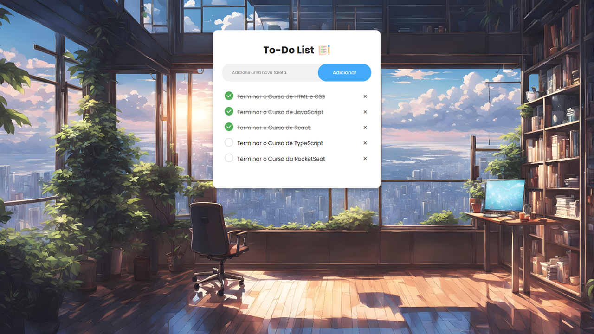

  

# 📝 To Do List
Projeto de um To Do List, você escreve as suas tarefas e salva elas no LocalStored do navegador;

- Veja o projeto: [Live Preview](https://victtor-to-do-list.vercel.app/)

## ⚙️ Funcionalidades

- [x] Salva as tarefas no LocalStored;
- [x] Pode marcar como concluída ou apagar;
- [ ] (Em breve) Função Drag and Drop, para puxar e colocar a tarefa onde quiser;

## 🚀 Tecnologias

- [HTML](https://www.w3schools.com/html/)
- [CSS](https://developer.mozilla.org/pt-BR/docs/Web/CSS)
- [JavaScript](https://developer.mozilla.org/pt-BR/docs/Web/JavaScript)

## 📝 Considerações

Fiz esse projeto para o meu portfolio para treinar meus conhecimentos em Javascript e manipulação do DOM;
